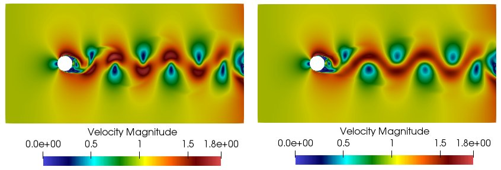
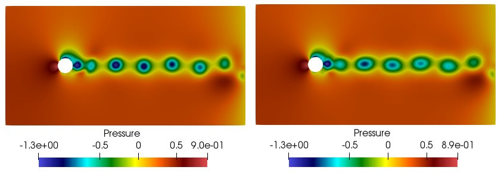
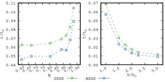

## Problem

Simulating unsteady fluid flows with the full Navier-Stokes equations is computationally expensive. When many evaluations are needed — for design optimization, parametric studies, or real-time applications — running a full simulation each time is impractical.

## Approach

A stabilized reduced-order model (ROM) was built from a finite element full-order model (FOM) of flow past a circular cylinder at Reynolds number 1000 — a canonical problem with unsteady vortex shedding. The ROM compresses the solution into a small set of basis modes using Proper Orthogonal Decomposition (POD), reducing the degrees of freedom from ~90,000 to fewer than 30 while preserving the flow dynamics.

A Variational Multi-Scale (VMS) stabilization was applied to both the FOM and the ROM to handle the convection-dominated nature of the flow.

## Results

The ROM accurately reproduces the velocity and pressure fields of the full simulation, including the vortex shedding pattern.

*Velocity field (top) and subscales (bottom) at t=50 for FOM (left) and ROM (right).*

*Pressure field (top) and subscales (bottom) at t=50 for FOM (left) and ROM (right).*

The ROM achieves up to **93% reduction in computation time** compared to the full simulation, with further savings possible using mesh-based hyper-reduction.

*Computational time ratio of ROM and hyper-ROM relative to the full simulation.*

## Publication

Full details in: R. Reyes, R. Codina, *Projection-based reduced order models for flow problems: A variational multiscale approach*, Computer Methods in Applied Mechanics and Engineering, 363 (2020). [DOI: 10.1016/j.cma.2020.112844](https://doi.org/10.1016/j.cma.2020.112844)
